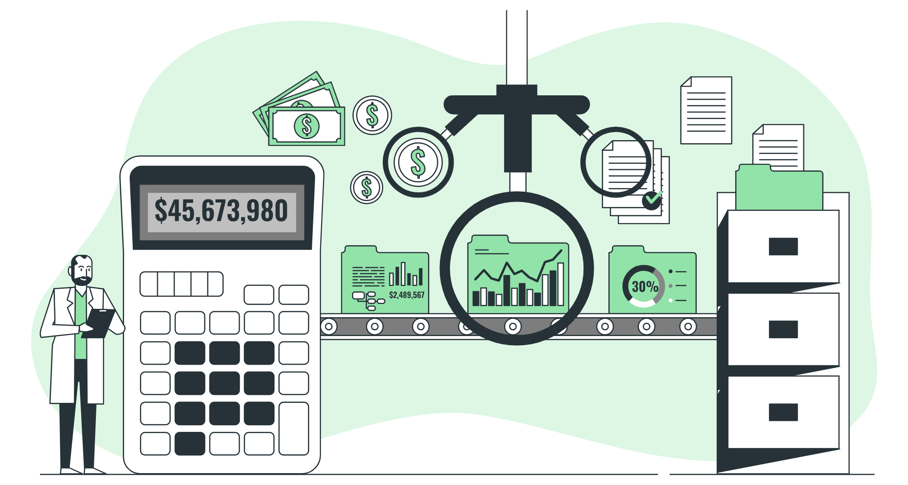

Aqui você encontrará todas as informações e recursos necessários para integrar nossas APIs em seu sistema ou aplicação. A partir daqui, você poderá explorar a funcionalidade de nossas APIs e entender como elas podem ser utilizadas para melhorar a experiência de seus usuários.

Além disso, também forneceremos exemplos de código e dicas para garantir uma integração bem-sucedida.

**Esperamos que esta documentação seja fácil de usar e útil para você.**

> 💡 **Procurando por alguma informação específica?**  
> Temos uma função de pesquisa muito prática. Basta pressionar Command+K (MacOS) ou Ctrl+K (Windows) e digitar o que você está procurando!

---

Qualquer dúvida ou sugestão, por favor, não hesite em [entrar em contato conosco](https://api.whatsapp.com/send/?phone=5531973049705&text&type=phone_number&app_absent=0).

## Sobre nós

Somos uma Infratech de Dados para Crédito, Risco, Cadastro e Compliance.

<CardGroup cols={2}>
  <Card title="Edit Your Docs" icon="pen-to-square" href="https://mintlify.com/docs/quickstart">
    Get your docs set up locally for easy development
  </Card>
  <Card title="Preview Changes" icon="image" href="https://mintlify.com/docs/development">
    Preview your changes before you push to make sure they're perfect
  </Card>
</CardGroup>

## Make it yours

Update your docs to your brand and add valuable content for the best user conversion.

<CardGroup cols={2}>
  <Card title="Customize Style" icon="palette" href="https://mintlify.com/docs/settings/global">
    Customize your docs to your company's colors and brands
  </Card>
  <Card title="Reference APIs" icon="code" href="https://mintlify.com/docs/api-playground/openapi">
    Automatically generate endpoints from an OpenAPI spec
  </Card>
  <Card title="Add Components" icon="screwdriver-wrench" href="https://mintlify.com/docs/content/components/accordions">
    Build interactive features and designs to guide your users
  </Card>
  <Card title="Get Inspiration" icon="stars" href="https://mintlify.com/customers">
    Check out our showcase of our favorite documentation
  </Card>
</CardGroup>